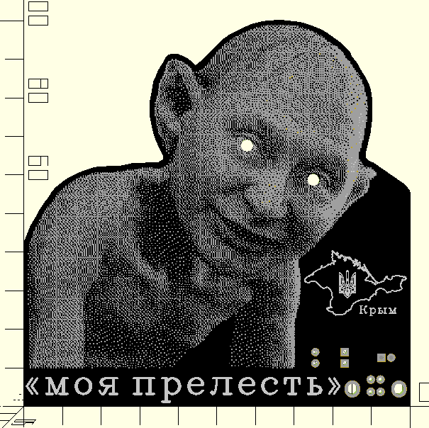
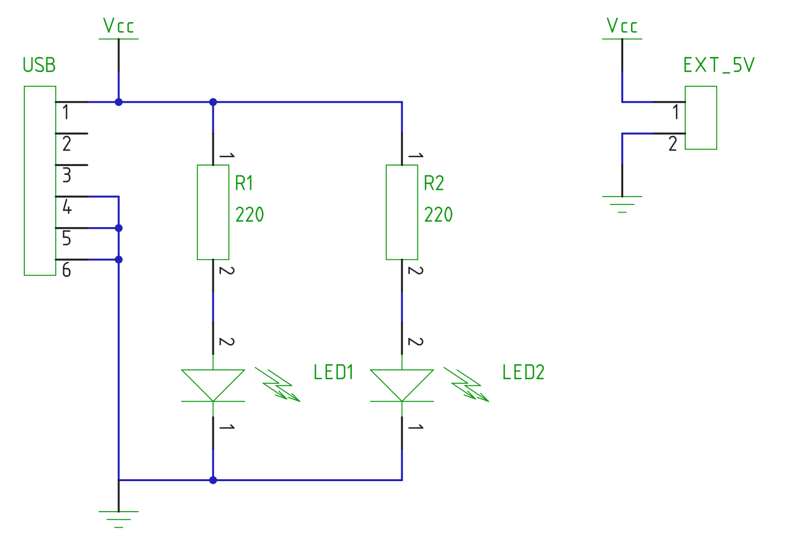

# STEM4ukraine-My-Precious

Build this fun project to reflect on the essence of russian spirituality and soulfulness, as discussed by Dostoevsky.

A simple and fun school STEM project demonstrating simple through hole soldering and analogue electronics using USB to power the circuit.

The circuit is very simple, using a pair of resistors and USB power to drive the Gollum's eyes.

If you like this, you should also check out the wearable badge in the STEM4ukraine-Russian-Soul repository! 

The prototype is currently undergoing manufacturing and testing

An openscad render of the front of the PCB:

The "My Precious" schematic:

